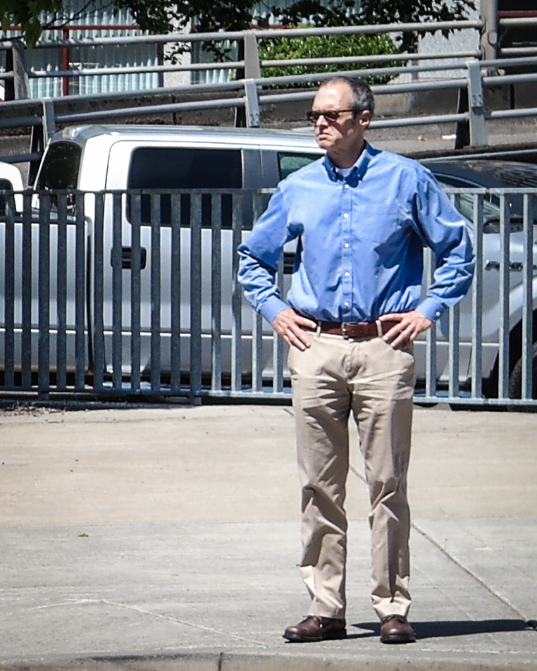
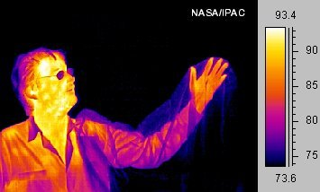
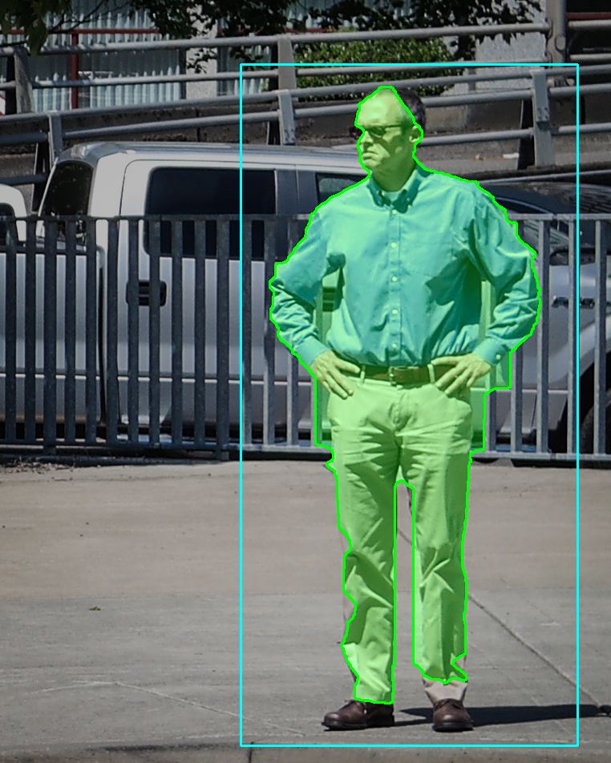
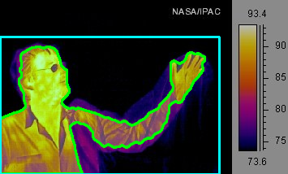
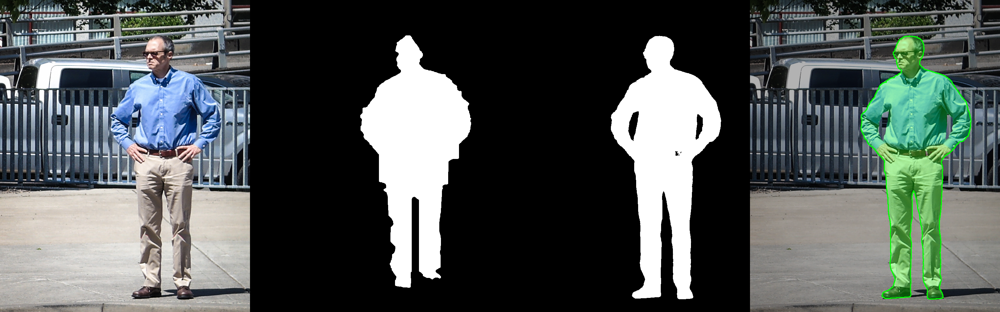
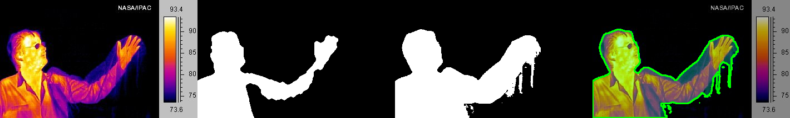
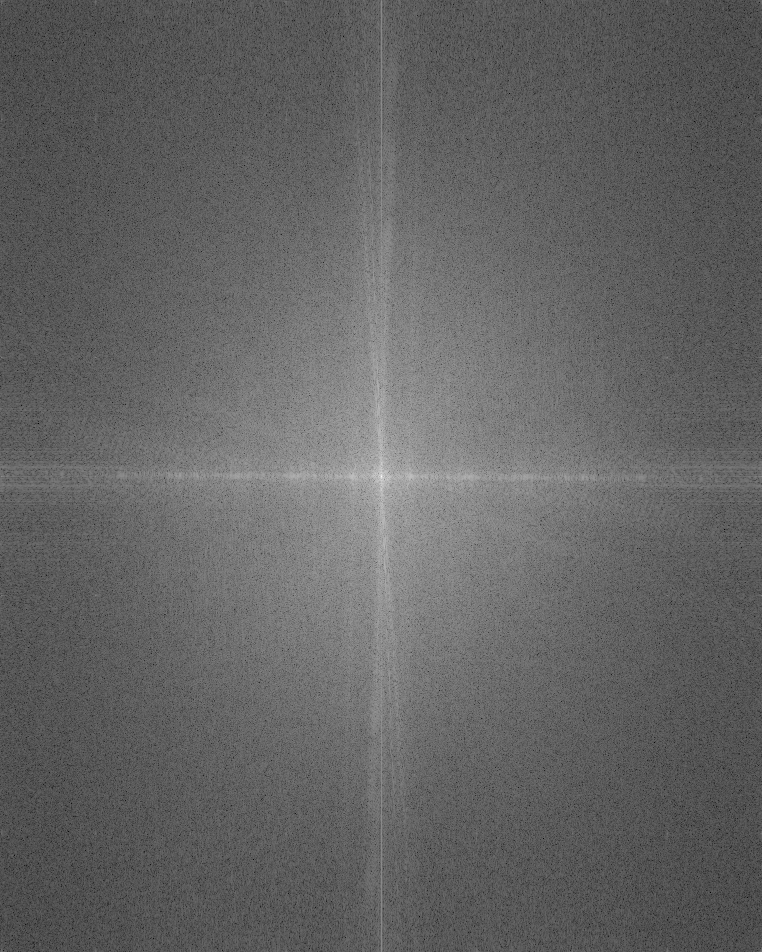
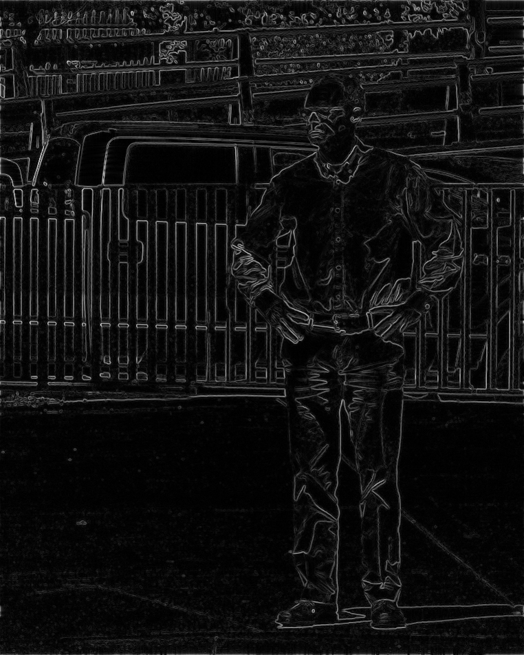
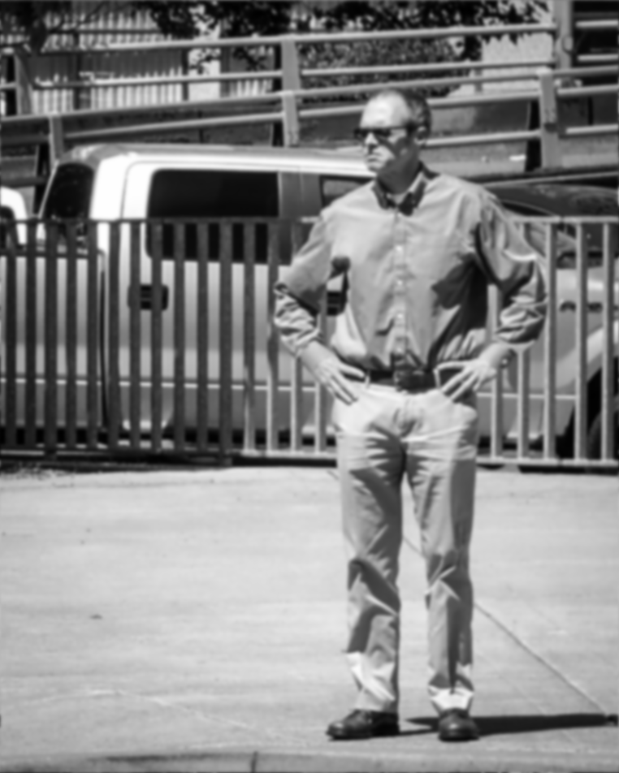
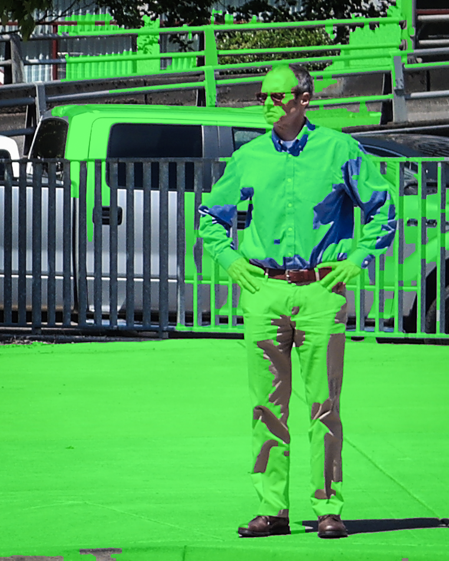

# CSc 8830 Advanced Computer Vision - Module 4
## Human Boundary Segmentation

**Student:** Olumide Adebisi  
**GitHub:** https://github.com/Olumide1996/CSC8830_Module4  
**Module 4 web app:** https://csc8830-module4-olumide.streamlit.app/  
**Course portal:** https://csc8830-computer-vision.streamlit.app/

## 1. Objective and scope

The assignment asks for a script that finds the boundary of a human in an RGB image and a thermal image using classical image processing, followed by a comparison with SAM2. It also asks for a mathematical explanation of edge detection and region segmentation in the Fourier domain.

The main human-boundary pipeline in this project uses OpenCV operations only. SAM2 is run separately as a reference comparison and is not part of the primary segmentation pipeline.

The RGB and thermal examples use manually supplied approximate bounding boxes to define the region containing the person. Within those regions, the segmentation is obtained from color or intensity information plus morphology and connected-component cleanup.

## 2. Experimental setup

### RGB example

The RGB image is the public Wikimedia Commons example `Man Standing.jpg` by Visitor7, licensed CC BY-SA 3.0.

Bounding box used: `(300, 80, 720, 930)`.



### Thermal example

The final thermal example used for the reported experiment is the clear NASA/IPAC infrared human image distributed as a public-domain example.

Bounding box used: `(0, 45, 270, 214)`.



The bounding boxes are only approximate object-location hints. They are not the segmentation masks themselves. The same boxes were supplied to SAM2 so both methods received the same basic location information.

## 3. Classical RGB human segmentation

The RGB method works inside the supplied bounding box. The ROI is converted from BGR to CIELAB. A background color is estimated from the median Lab values along the ROI border. Each pixel is compared with that background estimate, and Otsu thresholding creates a binary color-distance mask.

A Canny edge map is added so that body and clothing boundaries are not lost. Morphological closing and opening reduce gaps and isolated noise. A distance transform supplies a foreground core. Connected-component filtering, hole filling, and contour extraction produce the final mask.



Final RGB measurements:

| Metric | Result |
|---|---:|
| Foreground pixels | 135,958 |
| Mask fraction | 18.74% |
| Boundary perimeter | 2580.4 px |

## 4. Classical thermal human segmentation

The thermal display is converted to grayscale and lightly blurred with a 5x5 Gaussian kernel. Otsu thresholding provides an image-dependent separation between hotter and darker pixels. Morphological closing keeps the raised arm connected to the body, while opening removes small isolated regions.

The largest connected component inside the person box is retained. A percentile-based fallback threshold is available if Otsu produces an implausibly small region. Final post-processing fills holes and returns the mask to full-image coordinates.



Final thermal measurements:

| Metric | Result |
|---|---:|
| Foreground pixels | 16,349 |
| Mask fraction | 21.52% |
| Boundary perimeter | 1001.0 px |

## 5. SAM2 comparison

SAM2 is a promptable segmentation model developed by Meta that accepts image prompts such as clicks, boxes, or masks. The experiment used the Transformers checkpoint `facebook/sam2.1-hiera-tiny`. The model was run separately from the classical pipeline using the same approximate bounding-box prompt.

RGB comparison:



Thermal comparison:



The mask-overlap metrics are:

\[
\mathrm{IoU}=\frac{|A\cap B|}{|A\cup B|},\qquad
\mathrm{Dice}=\frac{2|A\cap B|}{|A|+|B|}
\]

| Modality | Classical vs. SAM2 IoU | Classical vs. SAM2 Dice |
|---|---:|---:|
| RGB | 0.8706 | 0.9308 |
| Thermal | 0.6993 | 0.8231 |

These values quantify agreement between the classical mask and the SAM2 mask. They are **not ground-truth accuracy values**, because no manually labeled reference mask was created for this assignment.

## 6. Fourier-domain theory

Let the image be `f(x,y)` with Fourier transform `F(u,v)`. Spatial derivatives become multiplications by frequency in the Fourier domain:

\[
\mathcal{F}\left\{\frac{\partial f}{\partial x}\right\}=j2\pi uF(u,v),
\qquad
\mathcal{F}\left\{\frac{\partial f}{\partial y}\right\}=j2\pi vF(u,v)
\]

After inverse transforming the derivative responses, the gradient magnitude is

\[
G(x,y)=\sqrt{G_x^2(x,y)+G_y^2(x,y)}.
\]

Large responses occur where image intensity changes rapidly, which is why the edge map emphasizes object boundaries as well as strong background edges.

For the Laplacian,

\[
\mathcal{F}\{\nabla^2 f\}=-4\pi^2(u^2+v^2)F(u,v).
\]

The multiplier grows with frequency, so the Laplacian also emphasizes higher-frequency content.

For a frequency response `H(u,v)`, frequency-domain filtering is

\[
g(x,y)=\mathcal{F}^{-1}\{H(u,v)F(u,v)\}.
\]

A simple threshold can then form a region mask:

\[
M(x,y)=\begin{cases}
1,&g(x,y)>T\\
0,&g(x,y)\le T
\end{cases}
\]

### Implemented Fourier demonstration

The Fourier script computes a centered FFT magnitude spectrum, forms gradient derivatives with the `j2πu` and `j2πv` multipliers, and creates a gradient-magnitude edge map. It then applies a Gaussian low-pass filter with normalized-frequency sigma `0.08`, performs Otsu thresholding on the filtered image, applies morphology, and keeps the largest connected component.









The simple frequency-filter/threshold demonstration over-segments strong background structures such as railings, the vehicle, and pavement. This is expected because high-frequency components identify rapid intensity changes wherever they occur, not only at the human boundary. The Fourier implementation is therefore presented as the requested theory demonstration, while the final human masks use the classical spatial-domain OpenCV pipeline.

## 7. Results and discussion

The RGB result follows the person through the head, shoulders, arms, torso, legs, and shoes. The thermal result follows the hot human region and preserves the raised arm and hand.

The RGB and thermal IoU/Dice values show the degree of overlap between the classical and SAM2 masks. They should be interpreted as method-to-method agreement rather than accuracy against ground truth.

The Fourier results demonstrate the requested frequency-domain concepts, while also showing the practical limitation of using a simple thresholded frequency response for human segmentation in a cluttered scene.

## 8. Limitations

- The classical pipeline uses a user-provided approximate bounding box. Fully automatic person localization would require an additional detection stage.
- RGB segmentation depends on contrast between the person and local background.
- Thermal segmentation depends on the thermal contrast visible in the supplied image and display palette.
- The simple Fourier threshold demonstration over-segments strong background edges.
- Ground-truth segmentation masks were not available, so IoU/Dice are not accuracy measurements.

## 9. Web application and verification

The public Streamlit app presents the saved RGB and thermal classical outputs, SAM2 comparison panels and metrics, Fourier results, mathematical theory, and an interactive upload path for the classical method.

The permanent course portal lists Modules 2, 3, and 4:

https://csc8830-computer-vision.streamlit.app/

The Module 4 public app is:

https://csc8830-module4-olumide.streamlit.app/

The final local automated test run completed with **5 passed tests**.

### Main reproduction commands

```powershell
python -m pytest -q

python src\run_experiment.py --image data\rgb\rgb_human.jpg --modality rgb --bbox 300 80 720 930 --output-dir outputs\rgb

python src\run_experiment.py --image data\thermal\thermal_human.jpg --modality thermal --bbox 0 45 270 214 --output-dir outputs\thermal

python scripts\fourier_analysis.py --image data\rgb\rgb_human.jpg --output-dir outputs\rgb\fourier

python src\sam2_compare.py --image data\rgb\rgb_human.jpg --bbox 300 80 720 930 --classical-mask outputs\rgb\classical_mask.png --output-mask outputs\rgb\sam2_mask.png

python src\sam2_compare.py --image data\thermal\thermal_human.jpg --bbox 0 45 270 214 --classical-mask outputs\thermal\classical_mask.png --output-mask outputs\thermal\sam2_mask.png
```

## 10. Conclusion

This project demonstrates a complete classical human-boundary segmentation workflow for both RGB and thermal images. The RGB method combines Lab color distance, Canny edges, morphology, connected components, and contours. The thermal method uses grayscale intensity, Otsu thresholding, morphology, and connected components. Both run without a machine-learning or deep-learning model in the primary pipeline.

SAM2 provides a separate reference point. Using the same approximate box prompt, the classical and SAM2 masks have IoU/Dice overlaps of `0.8706/0.9308` for RGB and `0.6993/0.8231` for thermal. These values quantify overlap between the two methods rather than ground-truth accuracy.

The Fourier portion connects the implementation to the requested theory. Spatial derivatives become frequency multipliers, high-frequency components emphasize rapid changes, and frequency-domain filtering can be followed by thresholding to form regions. The experiment also shows why frequency information alone is not enough to isolate a person in a cluttered image: strong background edges are selected too.

## References

1. Meta AI. "Introducing Meta Segment Anything Model 2 (SAM 2)." 2024. https://ai.meta.com/research/sam2/
2. Ravi, N., et al. "SAM 2: Segment Anything in Images and Videos." arXiv:2408.00714, 2024. https://arxiv.org/abs/2408.00714
3. Hugging Face. `facebook/sam2.1-hiera-tiny` model card and Transformers usage. https://huggingface.co/facebook/sam2.1-hiera-tiny
4. OpenCV documentation. Canny Edge Detection, Image Thresholding, and Morphological Transformations. https://docs.opencv.org/4.x/
5. Wikimedia Commons. "Man Standing.jpg" by Visitor7, CC BY-SA 3.0. https://commons.wikimedia.org/wiki/File:Man_Standing.jpg
6. NASA/IPAC Infrared Science Archive. "Human-Infrared.jpg" public-domain thermal example.
